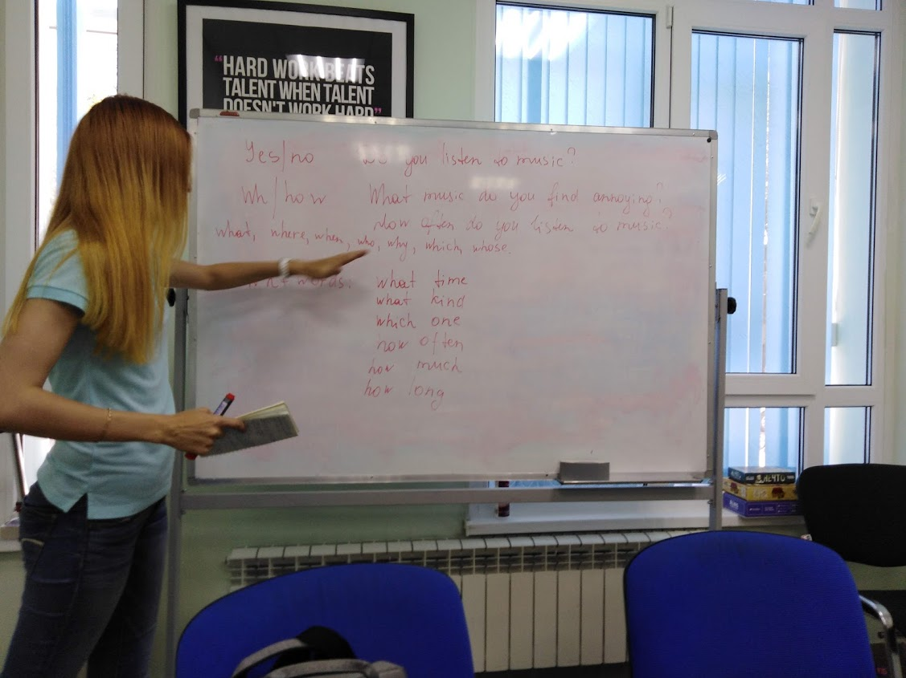

## Music terminology
Jazz, classic, opera, folk, rock, pop, soul, techno, country, ...

Single, composer, chorus, album, concert, soundtrack, lyrics, band, solo, scale, bit, ...

## Have/have got
Have got don't use in the Past

> Have you got any money? (Right now)

> When she was a child she **had** a long hair.

> **Did** you **have** a car when you **lived** in London?

## New phrases
> **Freaked out** - Бояться

> **Get on my nerves** - Действлвать на нервы

> **Dragging my feet** - Дрожь в ногоах (бояться)

> **Show me the ropes** - Показать канаты (Объяснить как пользоваьтся)

> **Don't be a chicken** - Не будь цыпленком (Не бойся)

> **Owes me a favour** - Оказать услугу

> **Cheer up a friend** - Подбодрить друга

