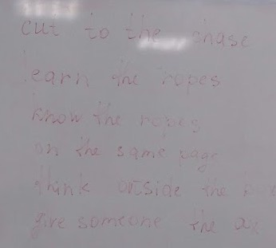

## Areas
> **Residential area** - жилая зона

> **Commertial area** - торговая зона

> **Industrial area** - промышленная зона

## Places
> Bars, cinemas, night clubs, theatres, cafes, restaraunts, libaries, bookshops, stores, schools, colleges, museums, galleries, bus stations, hospitals, stadiums, leisure centers

## Describing places
> Romantic, beautiful, noisly, relaxing, exciting, impressive, crowded, pleasant, peaceful, wild

## New phrases

> Cut to the chase (Прекратить погоню, Перейти к делу)

> Learn the ropes (Изучить основы)

> On the same page (На одной волне)

> Think outside the box (Думать не по шаблону)

> Give someone the axe (Уволить)