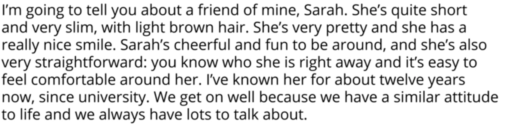

## Positive adjectives

> Kind, considerate, warm, funny, entertaning, carring, honest, straightforward, reliable, cheerful, positive, optimistic, cute, charming, ravishing, artsy, determind, hyper, ambitious, chatty, easy-going, hard-working, open, sensetive, organized

You can add examples and reasons or add a story.
> Is really, is a very, is such an ...

## Negative characteristic

> Flaws, the bad side of someone's personality

> Kind -> Unkind, Honest -> Dishonest, Considerate -> Inconsiderate, Reliable -> Unreliable

> Selfish, greedy, self-centered, self-obsessed, dull, humourless (too serious), insincere, moody, grumpy, reserved

## Life examples

> My sister is really funny.

> My friend Lia is very cheerful person.

> My brother can be a little ____ sometimes.

> Sometimes I feel that she is a bit ____.

> Nancy is so ____ today.

<iframe width="560" height="315" src="https://www.youtube.com/embed/7bdRcIpN1jU" frameborder="0" allow="accelerometer; autoplay; encrypted-media; gyroscope; picture-in-picture" allowfullscreen></iframe>




## Сonditional mood

If + ```Present Simple``` + ```will \ won't``` + ```Verb```

> If I have time this weekend, I will come.

## Homework

> If yoo win the 1st prize you will got a car 

> If yoo win the 2nd prize you will got a bike

> If yoo win the 3rd prize you will got a motobike

> If yoo win the 4th prize you will got a bicycle

> If yoo win the 5th prize you will got a scooter
