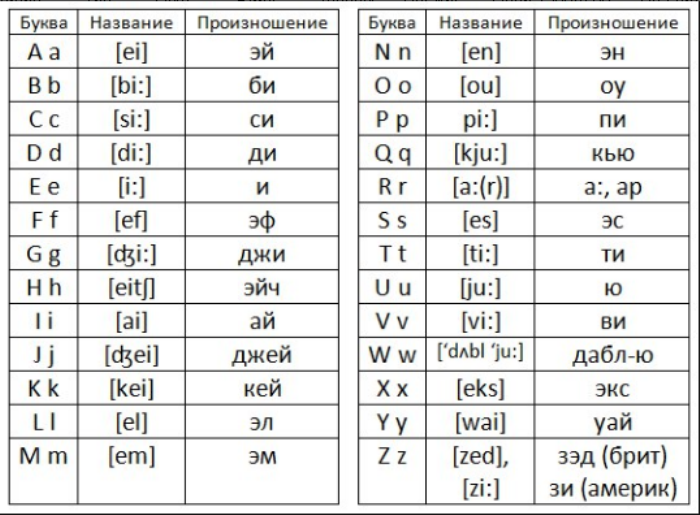
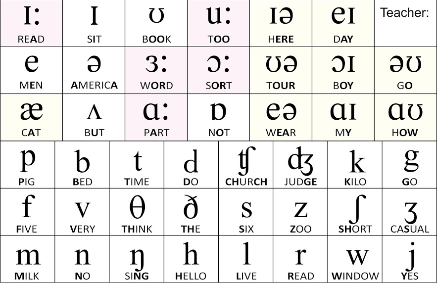
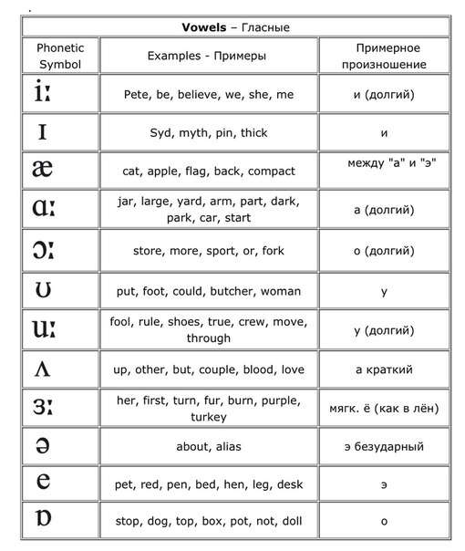
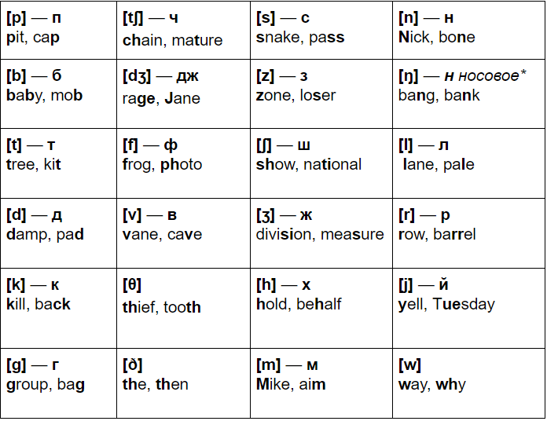

## Begin phrases (вводные слова)

* **Actually** (на самом деле)

* **In short** (Вкраце)

* **The think is** (дело в том, что)

* **By the way** (Между прочим)

* **I mean** (Я имею в виду)

* **Anyway**

* **Well** (Ну)

* **Meantime** (тем временем)

* **Basically** (В основном)

* **Of course** (Конечно)

* **Probably** (Вероятно)

* **Telling the truth**

* **Frankly speaking** (честно говоря)

* **However** (однако)

* **In addition** (в дополнение)

* **Fortunatelly** (к счастью)

* **After all** (в конце концов)

* **In my case** (в моем случае)

* **As far as I know** (Насколько я знаю)

## Meetings

> Have a metting, hold a meeting, give updates, attend, agenda, make dissisions, voting, colloborate, brainstorm, meating minutes (заметки), strategy, organize, schedule, consensus, chairperson, target, aim, My goal is ...

> Exactly, You absolutely right, I completely agree, I absolutely agree, I'm with Peter on this

> I offer, I suggest, I recomend, Let's, We should

> Partial agree, It depends on ..., Up to a point, but ..., In principal, but ..., Yes, but ...

> I disagree, I'm not sure about that, I'm afraid I disagree, I see it differently

> May I say a word, Could I just say one thing, Excuse me, Sorry for interrupting, but ...

## Transcription

### Letters

### Sounds

### Гласные

### Согласные

